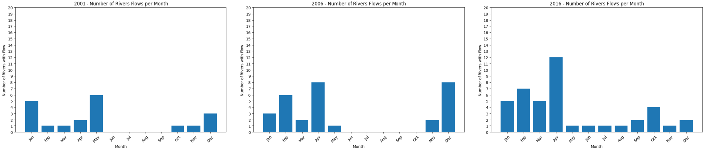
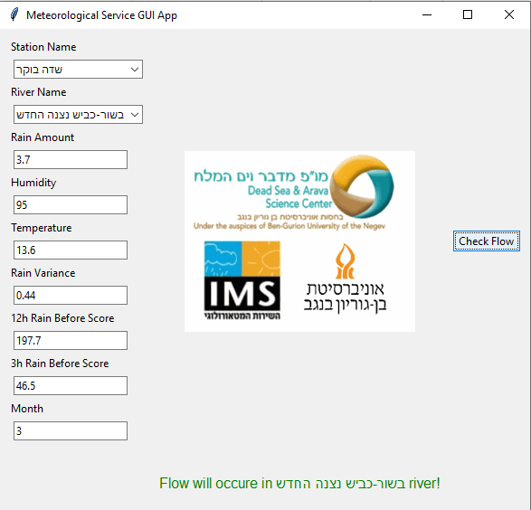
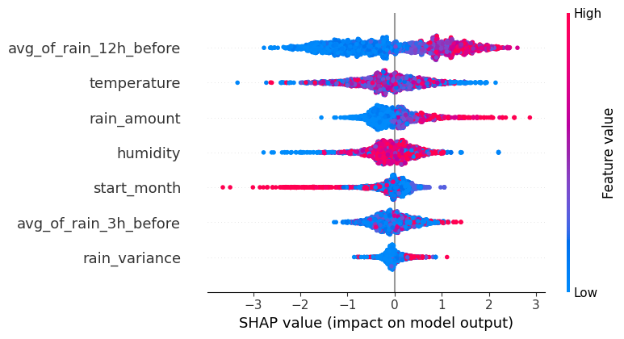

# Machine Learning Prediction of River Flows in Southern Israel using Meteotological Data 

## Overview

Southern Israel faces a critical challenge in water resource management due to the lack of historical hydraulic flow data. This repository presents a machine learning approach to predict historical river flows using high-resolution 10-minute meteorological data. The project includes data collection, feature engineering, model training, and a GUI application for further research.

## Datasets

All the csv datasets are available in the data directory.
Our data sources :
- **IMS Data**: Meteorological data obtained from the Israeli Meteorological Service (IMS).
- **Flows Data**: River flow data from the Water Authority in Israel for three periods.
- **Link Data**: Dataset for setting up time windows and links between meteorological and hydraulic stations.
- **Hydraulic Stations**: Hydraulic station data from the Water Authority.
Every dataset can be analyzed with visualizations in the visualizations.ipynb

<!--  -->

## Models and Analysis
In this repository you will find 3 models for each link betweeen meteorological station and hydraulic stations, resulting in a total of 63 ML models. 
In order to access them, you can (1) run the main_code.ipynb, (2) use the GUI application.

We are also providing a code for analysis of the model using SHAP.

## Repository Structure
- **data/**: Folder containing raw data files.
  - 10min_data.rar
  - flows_and_link_data.rar
  - stations_longitude_latitude.rar
- **assets/**: Folder containing png files for the readme.
- **meteorologicalServiceGUI/**: Folder containing the GUI application.
  - **Images/**: Images used in the GUI.
    - all.gif
    - all_new.png
  - **Models/**: 63 trained machine learning models (21 links * 3).
    - model1.pkl
    - model2.pkl
    - model3.pkl
    - ...
    - model63.pkl
  - runGui.py: GUI application code.
- Visualization.ipynb: Jupyter notebook for data visualization.
- get_data_from_api.py: Script for retrieving data from APIs of the IMS.
- main_code.ipynb: Jupyter notebook for the main project code.
- paper.pdf: Our paper. 
- README.md: This readme file.

## Getting Started
1. Clone the repository: `git clone https://github.com/yourusername/ML_prediction_of_river_flows.git`
2. Set up your Python environment with the required dependencies.
3. Explore the Jupyter notebooks and scripts for data analysis and model training.
4. In orter to use the GUI application for predictions, you will need to runt the runGUI.py file.

## Acknowlegment

We would like to deeply thank Dr. Avshalom Babad and Dr. Merav Cohen from the dead sea and the arava science center for their guidance and help througout the research.
Also, we would like to thanks Dr. Michael Fire for giving us the opportunity and the idea for this research.

